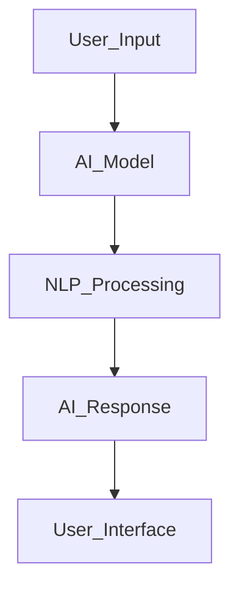

<div align="center">

# 🤖 Gen AI Projects Collection


<p align="center">
  
  
  
  
</p>

</div>

---

# 📌 Overview

This repository contains Generative AI and LLM-powered applications focused on solving real-world healthcare and nutrition-related problems using Artificial Intelligence.

The projects demonstrate practical implementation of Large Language Models (LLMs), Prompt Engineering, NLP pipelines, AI-based report simplification, and intelligent nutrition analysis systems using Python and modern AI frameworks.

---

# 🧠 Projects Included

---

## 🏥 AI Medical Simplifier

### 📖 Description

An AI-powered medical assistant designed to simplify complex medical reports and healthcare terminology into easy-to-understand language for patients and non-technical users.

The system leverages Large Language Models and NLP techniques to provide simplified explanations, medical insights, and user-friendly interpretations of healthcare documents.

### 🚀 Features

- Medical report simplification
- AI-generated healthcare explanations
- NLP-based text understanding
- Patient-friendly report interpretation
- Smart healthcare assistance

### 🛠️ Technologies Used

```bash
Python • OpenAI GPT • LangChain • NLP • Streamlit • Flask
```

---

## 🥗 Nutrition Analyser

### 📖 Description

An AI-powered nutrition analysis system that evaluates food items and provides detailed nutritional insights, calorie estimation, and health recommendations using Generative AI techniques.

The application helps users make healthier dietary decisions through intelligent food analysis and personalized nutritional guidance.

### 🚀 Features

- Food nutrition analysis
- Calorie estimation
- AI-generated health recommendations
- Dietary insights
- Intelligent food evaluation system

### 🛠️ Technologies Used

```bash
Python • Generative AI • OpenAI GPT • Pandas • Streamlit • NLP
```

---

# ⚡ Key Features

<div align="center">

| Feature | Status |
|---------|--------|
| Generative AI Applications | ✅ |
| LLM Integration | ✅ |
| Healthcare AI Solutions | ✅ |
| Nutrition Intelligence | ✅ |
| NLP Pipelines | ✅ |
| AI-powered Recommendations | ✅ |

</div>

---

# 🛠️ Tech Stack

<div align="center">

| Category | Technologies |
|----------|--------------|
| Languages | Python, SQL |
| Generative AI | OpenAI GPT, LLMs |
| Frameworks | LangChain, Streamlit, Flask |
| NLP | Natural Language Processing |
| Data Tools | Pandas, NumPy |
| Development Tools | Git, GitHub, VS Code, Jupyter Notebook |

</div>

---

# 📂 Repository Structure

```bash
Gen-AI-Projects/
│
├── AI_Medical_Simplifier/
│
├── Nutrition_Analyser/
│
├── datasets/
│
├── notebooks/
│
├── requirements.txt
│
└── README.md
```

---

# ⚙️ Installation

## 1️⃣ Clone the Repository

```bash
git clone https://github.com/sarvar786-ux/Gen-AI-Projects-.git
cd Gen-AI-Projects-
```

---

## 2️⃣ Create Virtual Environment

```bash
python -m venv venv
```

### Activate Environment

#### Windows

```bash
venv\Scripts\activate
```

#### Linux / Mac

```bash
source venv/bin/activate
```

---

## 3️⃣ Install Dependencies

```bash
pip install -r requirements.txt
```

---

# ▶️ Run the Applications

## Streamlit App

```bash
streamlit run app.py
```

## Flask App

```bash
python app.py
```

---

# 📊 Skills Demonstrated

✅ Generative AI  
✅ Large Language Models (LLMs)  
✅ Prompt Engineering  
✅ NLP Pipelines  
✅ AI-powered Healthcare Solutions  
✅ Nutrition Intelligence Systems  
✅ Streamlit Development  
✅ Flask Development  
✅ AI Application Development  
✅ Intelligent Automation  

---

# 🚀 AI Workflow



---

# 🌟 Repository Highlights

<div align="center">

| Project | Domain |
|---------|---------|
| AI Medical Simplifier | Healthcare AI |
| Nutrition Analyser | Health & Nutrition AI |

</div>

---

# 🔮 Future Enhancements

- 🤖 Advanced Multimodal AI Support
- 📱 Mobile Application Integration
- ☁️ Cloud Deployment
- 🧠 Personalized AI Recommendations
- 🌍 Multi-language Support
- 🔐 Secure User Authentication
- 📊 Advanced Nutrition Analytics

---

# 👨‍💻 Author

<div align="center">

## Mohammed Sarvar Ur Rahaman

<p align="center">
  <a href="https://github.com/sarvar786-ux">
    
  </a>

  <a href="https://www.linkedin.com/in/mohammed-sarvar/">
    
  </a>
</p>

</div>

---

<div align="center">

# ⭐ Support The Repository

If you found these projects useful, consider giving this repository a ⭐ on GitHub.


</div>

---

# 📜 License

This repository is intended for educational and research purposes.
